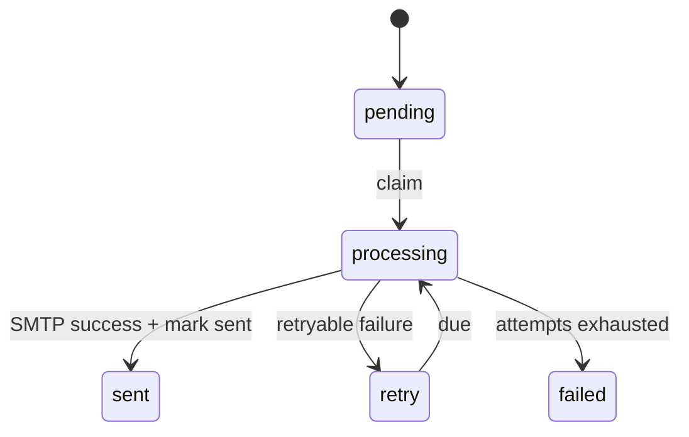

# Mail Delivery

AsterYggdrasil includes a generic mail delivery foundation: SMTP settings, mail templates, a durable outbox, administrator test mail, background dispatch, and audit records. It is reusable infrastructure for downstream flows such as registration activation, password reset, external-auth email verification, and login email codes.

Mail configuration is not stored in `config.toml`. It is runtime configuration stored in `system_config` and managed through the Admin Config API or the admin panel without restarting the service.

## Capability Boundary

The mail system includes:

- SMTP connection and sender settings.
- 7 built-in mail templates.
- A durable `mail_outbox` queue.
- The `mail-outbox-dispatch` periodic task on primary nodes.
- An administrator test-mail action.
- `mail_send` and `mail_delivery_failed` audit records.

It does not assume that every product enables public registration or password recovery. Downstream services can use only test mail, or enqueue outbox messages from their own product flows.

## Settings

Common settings:

| Key | Purpose |
| --- | --- |
| `mail_smtp_host` | SMTP server host. If empty, mail is treated as not configured. |
| `mail_smtp_port` | SMTP port, default `587`. |
| `mail_security` | Whether encryption is enabled. Port `465` uses implicit TLS; other ports use STARTTLS when enabled. |
| `mail_smtp_username` | SMTP username. |
| `mail_smtp_password` | SMTP password. This is a sensitive setting. |
| `mail_from_address` | Sender email address shown to recipients. If empty, mail is treated as not configured. |
| `mail_from_name` | Sender display name shown to recipients, default `AsterYggdrasil`. |
| `mail_outbox_dispatch_interval_secs` | Poll interval for the primary-node outbox dispatcher. |

SMTP authentication has one strict rule: `mail_smtp_username` and `mail_smtp_password` must either both be empty or both be set. Providing only one of them is a configuration error and mail delivery will fail as unavailable.

## Recommended Order

1. Set `mail_smtp_host`, `mail_smtp_port`, and `mail_security`.
2. If the SMTP service requires authentication, set `mail_smtp_username` and `mail_smtp_password`.
3. Set `mail_from_address` and `mail_from_name`.
4. Send a test email.
5. If templates generate external links, make sure `public_site_url` is set to the real public origin.
6. Then enable product features that depend on mail.

`public_site_url` should contain only the origin:

```text
https://app.example.com
```

Do not include a path or `/api`. Background mail delivery does not have the current browser Host, so it uses the configured public origin.

## Admin API

Read the config schema:

```text
GET /api/v1/admin/config/schema
```

Read template variables:

```text
GET /api/v1/admin/config/template-variables
```

Update a config value:

```text
PUT /api/v1/admin/config/{key}
```

Send test mail:

```text
POST /api/v1/admin/config/mail/action
```

Request body:

```json
{
  "action": "send_test_email",
  "target_email": "ops@example.com"
}
```

`target_email` is optional. If omitted, the message is sent to the current administrator account email. This is an administrator capability and should not be exposed to regular users.

## Mail Templates

Built-in template codes:

| Code | Purpose |
| --- | --- |
| `register_activation` | Registration activation. |
| `contact_change_confirmation` | New email confirmation. |
| `password_reset` | Password reset. |
| `password_reset_notice` | Password reset result notice. |
| `contact_change_notice` | Previous email change notice. |
| `external_auth_email_verification` | External-auth email verification. |
| `login_email_code` | Login email code. |

Each template has subject and HTML body settings. Do not guess variable names; read them from `GET /api/v1/admin/config/template-variables`. Template rendering escapes HTML variables before injecting user-controlled values.

## Outbox Dispatch

When product code needs to send mail, create an outbox record instead of blocking the request path on SMTP:

```text
mail_outbox_service::enqueue(...)
```

Primary nodes run the `mail-outbox-dispatch` periodic task. It claims due messages and delivers them in batches. The state flow is:



Failures are retried with backoff. Final failure moves the row to `failed` and records `mail_delivery_failed`. Successful delivery records `mail_send` only after `mark_sent` succeeds, reducing the duplicate-send window where SMTP succeeded but the database did not persist the sent state.

## Audit And Troubleshooting

Mail audit actions:

| Action | Trigger |
| --- | --- |
| `mail_send` | Test mail succeeds, or an outbox message is marked sent. |
| `mail_delivery_failed` | Test mail fails, or an outbox message reaches final failure. |
| `config_action_execute` | An administrator executes the `send_test_email` action. |

Audit details include fields such as `to_address`, `template_code`, `outbox_id`, `attempt_count`, and `error`. The Admin UI should display audit presentation first and avoid parsing raw detail strings.

Troubleshooting order:

1. Confirm `mail_smtp_host` and `mail_from_address` are not empty.
2. Confirm username and password are both empty or both set.
3. Confirm the port and `mail_security` match the SMTP service.
4. Check Admin Audit for `mail_delivery_failed`.
5. Check Admin Tasks for repeated `mail-outbox-dispatch` failures.
6. If templates include links, confirm `public_site_url` is an externally reachable origin.
