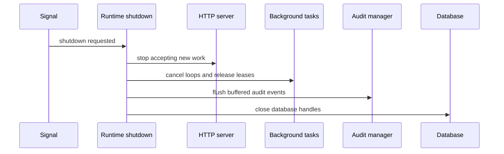

# Runtime

AsterYggdrasil's runtime is designed to make startup, background tasks, audit writes, health checks, and shutdown reusable across services. Downstream projects can add domain modules without redesigning the common lifecycle.

## Startup Mode

`server.start_mode` controls node mode:

```toml
[server]
start_mode = "primary"
```

Available values:

- `primary`: the default mode. Starts the HTTP service, background task dispatcher, and periodic maintenance tasks.
- `follower`: initializes common runtime and HTTP service, but skips primary-only tasks.

Follower mode is useful for future read-only nodes, managed ingress nodes, or topologies where one primary node owns global maintenance.

## Primary-only Tasks

Primary nodes start these runtime loops:

- background task dispatcher
- system health check
- auth session cleanup
- external auth login flow cleanup
- mail outbox dispatch
- audit log cleanup
- task artifact cleanup

These tasks own global maintenance. Running them on every node can cause duplicate claims, duplicate cleanup, or noisy audit records.

## Graceful Shutdown

When a shutdown signal is received, runtime coordinates shutdown:



The point is not to stop instantly. The point is to let important state reach storage. If task leases are not released or audit buffers are not flushed, the next startup may see stuck tasks or missing audit records.

## Background Dispatch

The background task system persists task state. The dispatcher claims runnable tasks, runtime writes heartbeat and lease state, and failures are classified for retry behavior.

When adding a task, decide:

- Whether the payload can be deserialized long term.
- Whether result and failure details are useful for administrators.
- Whether presentation codes exist for stable frontend display.
- Whether retry is safe and idempotent.

AsterYggdrasil does not assume regular users can see task records. The template provides admin-facing and runtime-facing task APIs only.

## Mail Outbox

Mail delivery is also a primary-only runtime responsibility. Product flows write to `mail_outbox`; the `mail-outbox-dispatch` periodic task claims due rows and sends SMTP messages.

This loop belongs on primary because mail is an external side effect. If multiple nodes deliver the same message, users may receive duplicate mail. If delivery succeeds but the sent state is not persisted, retries may send again. AsterYggdrasil keeps that window controlled with claim semantics, state transitions, post-delivery `mark_sent`, and audit records.

See [Mail Delivery](./mail.md) for settings, templates, and troubleshooting.

## Audit Writes

The audit manager supports buffered async writes. Request handlers can submit audit events without synchronously blocking on every database insert. During shutdown, runtime flushes the buffer to reduce loss risk.

When adding admin operations, authentication events, config changes, or maintenance actions, add audit records. Prefer structured details plus presentation mapping, not frontend parsing of raw JSON.

## Health Checks

Common endpoints:

```text
GET /health
GET /health/ready
GET /health/metrics
```

`/health` is a liveness check. `/health/ready` is a readiness check. `/health/metrics` requires the metrics feature and is intended for Prometheus-style scraping.

## Extension Rules

When adding runtime behavior, classify it first:

- Runs on every node: common startup.
- Runs only on one primary node: primary startup.
- Runs only on follower nodes: follower startup.
- Belongs to a product module: downstream runtime module.

Do not put product-specific periodic jobs directly into the shared startup path. Keep ownership clear so node modes stay understandable.
