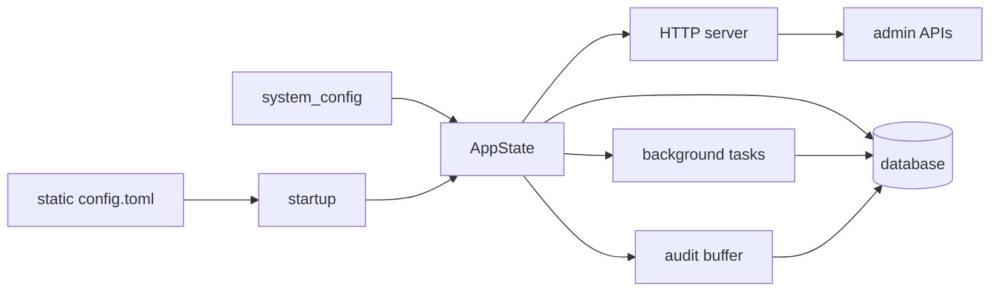

AsterYggdrasil is a reusable service foundation for Aster projects. It covers the Rust backend, React admin panel, runtime configuration, authentication, mail delivery, audit logs, background tasks, OpenAPI, deployment defaults, and project template initialization.

It is meant to be the starting point for new services, not a finished product domain. Downstream projects can add their own models, APIs, frontend pages, background jobs, and deployment rules while keeping the shared runtime foundation.

## When To Use It

AsterYggdrasil exists to avoid rebuilding the same service infrastructure for every project.

It already includes:

- Actix Web HTTP service with embedded frontend assets.
- SeaORM entities, migrations, repositories, transactions, and database retry helpers.
- Local auth, first-admin setup, session management, and external auth provider scaffolding.
- SMTP mail delivery, template variables, durable outbox, test mail, and mail audit records.
- Admin APIs for runtime config, audit logs, external auth providers, and background tasks.
- `system_config` runtime configuration, separated from static `config.toml`.
- Buffered audit writes, structured presentation data, and Admin UI query support.
- Background task records, dispatch, leases, heartbeat, retry, cleanup, and presentation data.
- Primary/follower startup mode, plus graceful shutdown for HTTP, tasks, audit, and databases.
- OpenAPI export, generated frontend service types, API catalog, and evergreen E2E smoke tests.
- Docker, GitHub Actions, VitePress docs, and `cargo-generate` template support.

## Recommended Path

If you only want to run the project, start with [Getting Started](./guide/getting-started.md).

If you want to build a new service on top of it:

1. Run the backend and frontend locally with [Getting Started](./guide/getting-started.md).
2. Use [Template Generation](./guide/template-generation.md) to initialize project naming.
3. Use [Configuration](./guide/configuration.md) to separate static config from runtime config.
4. Use [Authentication](./guide/authentication.md) to decide registration, external auth, and cookie policy.
5. Use [Mail Delivery](./guide/mail.md) to configure SMTP, templates, and test mail.
6. Use [Audit and Tasks](./guide/audit-tasks.md) when adding admin operations or background jobs.
7. Use [Docker Deployment](./deployment/docker.md) for a minimal production deployment.

Implementation notes, extension contracts, and maintenance checklists live under `developer-docs/`. The public `docs/` tree is for users and deployers.

## Runtime Overview



AsterYggdrasil keeps startup-critical values in static config, such as bind address, database URL, secrets, and node mode. Values that can be changed online live in `system_config` and are managed through the Admin Config API or the admin panel.

Background dispatch and periodic maintenance run only when `server.start_mode = "primary"`. A follower node initializes the common runtime, but skips the dispatcher, system health check, auth session cleanup, external auth flow cleanup, mail outbox dispatch, audit cleanup, and task artifact cleanup.

## Key Entrypoints

Local development:

```bash
cargo run
cd frontend-panel && bun run check
cd docs && bun run docs:dev
```

After startup:

```text
http://127.0.0.1:3000
http://127.0.0.1:3000/health
http://127.0.0.1:3000/health/ready
```

OpenAPI export and frontend service generation:

```bash
cargo test --features openapi generate_openapi
cd frontend-panel
bun run generate-api
```

## Next

- [Getting Started](./guide/getting-started.md)
- [Configuration](./guide/configuration.md)
- [Runtime](./guide/runtime.md)
- [Mail Delivery](./guide/mail.md)
- [Docker Deployment](./deployment/docker.md)
