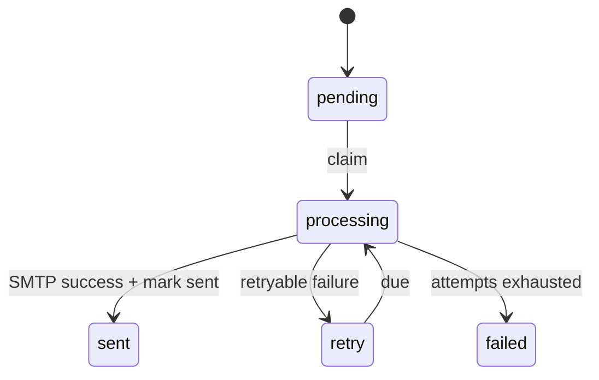

# 邮件投递

AsterYggdrasil 内置一套通用邮件投递能力：SMTP 配置、邮件模板、持久化 outbox、管理员测试邮件、后台投递任务和审计记录。它的定位是服务地基能力，给注册激活、密码重置、外部登录邮箱验证、登录邮箱验证码这类下游流程复用。

邮件配置不写在 `config.toml`。它属于运行时配置，存储在 `system_config`，通过 Admin Config API 或管理面板修改，不需要重启服务。

## 能力边界

邮件系统包含这些部分：

- SMTP 连接配置和发件人配置。
- 7 组内置邮件模板。
- `mail_outbox` 持久化发信队列。
- primary 节点上的 `mail-outbox-dispatch` 周期任务。
- 管理员发送测试邮件 action。
- `mail_send` 和 `mail_delivery_failed` 审计记录。

它不假设具体产品一定开放注册或一定有密码找回页面。下游项目可以只用测试邮件，也可以在自己的业务流程里调用 outbox enqueue。

## 配置项

常用配置项：

| Key | 说明 |
| --- | --- |
| `mail_smtp_host` | SMTP 服务器地址。为空时邮件服务视为未配置。 |
| `mail_smtp_port` | SMTP 端口，默认 `587`。 |
| `mail_security` | 是否启用加密。`465` 会使用隐式 TLS，其他端口启用时走 STARTTLS。 |
| `mail_smtp_username` | SMTP 登录用户名。 |
| `mail_smtp_password` | SMTP 登录密码，敏感配置。 |
| `mail_from_address` | 收件人看到的发件邮箱。为空时邮件服务视为未配置。 |
| `mail_from_name` | 收件人看到的发件人名称，默认 `AsterYggdrasil`。 |
| `mail_outbox_dispatch_interval_secs` | primary 节点轮询 outbox 的间隔。 |

SMTP 认证有一个硬约束：`mail_smtp_username` 和 `mail_smtp_password` 要么都为空，要么都填写。只填其中一个会被视为配置错误，发送时会返回邮件不可用。

## 推荐配置顺序

1. 填 `mail_smtp_host`、`mail_smtp_port` 和 `mail_security`。
2. 如果 SMTP 服务需要认证，填 `mail_smtp_username` 和 `mail_smtp_password`。
3. 填 `mail_from_address` 和 `mail_from_name`。
4. 发送一封测试邮件。
5. 如果邮件模板里会生成外部链接，确认 `public_site_url` 已经配置成真实访问来源。
6. 再开启依赖邮件的业务功能。

`public_site_url` 只应填来源，例如：

```text
https://app.example.com
```

不要带路径，不要带 `/api`。后台发信没有当前浏览器 Host，只能从运行时配置里取默认公开来源。

## Admin API

查询配置 schema：

```text
GET /api/v1/admin/config/schema
```

查询模板变量：

```text
GET /api/v1/admin/config/template-variables
```

修改配置项：

```text
PUT /api/v1/admin/config/{key}
```

发送测试邮件：

```text
POST /api/v1/admin/config/mail/action
```

请求体：

```json
{
  "action": "send_test_email",
  "target_email": "ops@example.com"
}
```

`target_email` 可省略；省略时会发送给当前管理员账号邮箱。这个接口是管理员能力，不应该暴露给普通用户。

## 邮件模板

内置模板 code：

| Code | 用途 |
| --- | --- |
| `register_activation` | 注册激活。 |
| `contact_change_confirmation` | 新邮箱确认。 |
| `password_reset` | 密码重置。 |
| `password_reset_notice` | 密码重置结果通知。 |
| `contact_change_notice` | 旧邮箱变更通知。 |
| `external_auth_email_verification` | 外部登录邮箱验证。 |
| `login_email_code` | 登录邮箱验证码。 |

每组模板都有 subject 和 HTML body 配置项。可用变量不要靠猜，使用 `GET /api/v1/admin/config/template-variables` 获取。模板渲染时会对 HTML 变量做转义，避免把用户输入直接拼进 HTML。

## Outbox 投递

业务代码需要发邮件时，应创建 outbox 记录，而不是在请求路径里直接阻塞 SMTP：

```text
mail_outbox_service::enqueue(...)
```

primary 节点会运行 `mail-outbox-dispatch` 周期任务，批量 claim 到期邮件并投递。状态流转大致是：



投递失败会按退避策略重试。最终失败会进入 `failed`，并写入 `mail_delivery_failed` 审计。发送成功只有在 `mark_sent` 成功后才写入 `mail_send`，这样可以减少“SMTP 已发出但数据库没记住”的双发窗口。

## 审计与排查

邮件相关审计 action：

| Action | 触发时机 |
| --- | --- |
| `mail_send` | 测试邮件发送成功，或 outbox 邮件成功标记为已发送。 |
| `mail_delivery_failed` | 测试邮件失败，或 outbox 邮件最终失败。 |
| `config_action_execute` | 管理员执行 `send_test_email` action。 |

审计 details 会记录 `to_address`、`template_code`、`outbox_id`、`attempt_count` 和 `error` 等字段。Admin UI 应优先使用 audit presentation，不要解析 raw details 字符串。

常见排查顺序：

1. 确认 `mail_smtp_host` 和 `mail_from_address` 非空。
2. 确认用户名和密码同时为空或同时填写。
3. 确认端口和 `mail_security` 与 SMTP 服务一致。
4. 看 Admin Audit 里是否有 `mail_delivery_failed`。
5. 看 Admin Tasks 里 `mail-outbox-dispatch` 是否持续失败。
6. 如果模板里有链接，确认 `public_site_url` 是外部能打开的来源。
