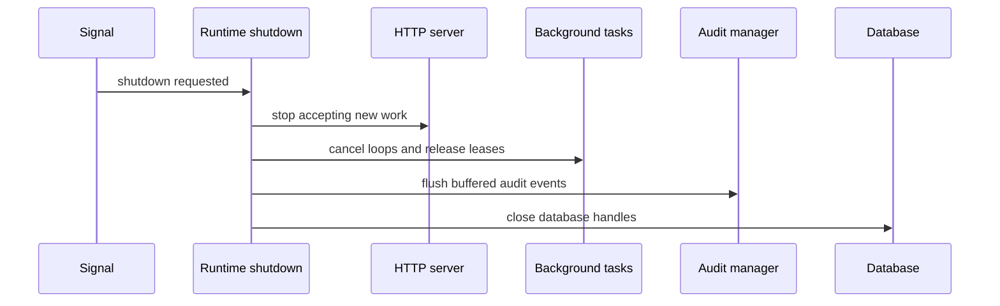

# 运行时

AsterYggdrasil 的运行时目标是把服务启动、后台任务、审计写入、健康检查和退出流程做成可复用基础能力。下游项目新增业务模块时，不需要重新设计这些通用生命周期。

## 启动模式

`server.start_mode` 控制节点启动模式：

```toml
[server]
start_mode = "primary"
```

可用值：

- `primary`：默认模式。启动 HTTP 服务、后台任务 dispatcher 和周期维护任务。
- `follower`：初始化公共运行时和 HTTP 服务，但跳过 primary-only 任务。

Follower 模式适合未来接入只读节点、受控入口节点或由主节点统一调度的拓扑。它不应该执行会修改全局状态的维护 loop。

## Primary-only 任务

Primary 节点会启动这些运行时 loop：

- background task dispatcher
- system health check
- auth session cleanup
- external auth login flow cleanup
- mail outbox dispatch
- audit log cleanup
- task artifact cleanup

这些任务都属于全局维护职责。如果多个节点同时执行，容易产生重复 claim、重复清理或审计噪声，所以默认只放在 primary。

## 优雅退出

服务收到退出信号后，会按运行时状态协调关闭：



这个流程的重点不是“马上停”，而是让已经进入系统的关键状态有机会落库。尤其是后台任务和审计，如果退出时不释放 lease 或 flush buffer，下一次启动很容易出现任务悬挂或审计缺口。

## 后台任务调度

后台任务系统使用持久化记录表达任务状态。核心状态包括 queued、running、succeeded、failed、cancelled 这类生命周期状态。dispatcher 会 claim 可执行任务，运行时会写入 heartbeat 和 lease 信息，失败后按 retry classification 决定是否可重试。

新增任务时，应该同时考虑：

- 任务 payload 是否能长期稳定反序列化。
- result 和 failure detail 是否足够让管理员判断问题。
- 是否需要 presentation code 给前端显示稳定标题和状态。
- 失败是否允许重试，以及重试会不会造成重复副作用。

普通用户任务可见性不是 AsterYggdrasil 的默认假设。这个仓库只提供管理员和运行时层面的任务 API。

## 邮件 Outbox

邮件投递也是 primary-only 运行时职责。业务流程写入 `mail_outbox` 后，由 `mail-outbox-dispatch` 周期任务 claim 到期记录并发送 SMTP。

这个 loop 放在 primary 的原因很简单：邮件是外部副作用。如果多个节点同时投递同一封邮件，用户可能收到重复邮件；如果投递成功后没有正确标记状态，后续重试也可能重复发送。AsterYggdrasil 通过 claim、状态流转、发送后 `mark_sent` 和审计记录把这个窗口压到可控范围。

邮件配置、模板和排查见 [邮件投递](./mail.md)。

## 审计写入

Audit manager 支持异步缓冲写入。业务代码提交审计事件后，不需要在请求路径里同步阻塞到数据库写入完成。退出时 runtime 会 flush buffer，降低丢失风险。

新增管理员操作、认证操作、配置变更或维护操作时，应优先补审计。审计内容建议使用结构化 details，再通过 presentation 层给前端稳定显示信息，避免前端解析 raw JSON。

## 健康检查

常用端点：

```text
GET /health
GET /health/ready
GET /health/metrics
```

`/health` 用于基础存活检查，`/health/ready` 用于 readiness。`/health/metrics` 需要启用 metrics feature，适合接 Prometheus。

## 下游扩展原则

新增 runtime 能力时，先判断它属于哪一类：

- 每个节点都应该运行：放在 common startup。
- 只有一个主节点应该运行：放在 primary startup。
- 只在 follower 节点运行：放在 follower startup。
- 只服务某个业务模块：放在下游项目自己的 runtime 模块里。

不要把业务模块的周期任务直接塞进通用 startup。先做清楚职责边界，后面节点模式才不会变成一堆条件分支。
