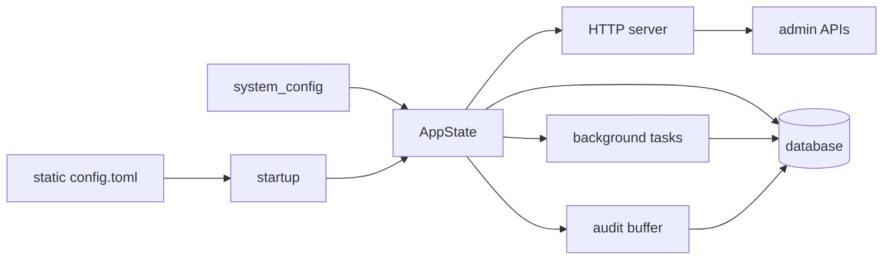

AsterYggdrasil 是 Aster 系列项目的可复用服务地基，覆盖 Rust 后端、React 管理面板、运行时配置、认证、邮件投递、审计日志、后台任务、OpenAPI、部署默认值和项目模板初始化。

它适合被当作新服务的起点，而不是某个具体业务产品。下游项目可以在这个基础上增加自己的领域模型、API、前端页面、后台任务和部署策略，同时继续复用已经做好的运行时能力。

## 适用场景

使用 AsterYggdrasil 的目标很直接：减少每个服务都要重新做一遍的基础设施代码。

它已经准备好这些通用能力：

- Actix Web HTTP 服务，支持内嵌前端静态资源。
- SeaORM 数据模型、迁移、repository、事务和数据库重试。
- 本地认证、首个管理员初始化、会话管理和外部认证 provider 框架。
- SMTP 邮件投递、模板变量、持久化 outbox、测试邮件和邮件审计。
- 管理员 API，包括运行时配置、审计日志、外部认证 provider 和后台任务。
- `system_config` 运行时配置，和静态 `config.toml` 分离。
- 异步审计写入、结构化展示信息和 Admin UI 查询入口。
- 后台任务记录、调度、lease、heartbeat、重试、清理和展示信息。
- primary/follower 启动模式，以及 HTTP、任务、审计、数据库的优雅退出。
- OpenAPI 导出、前端类型生成、API catalog 和常绿 E2E smoke test。
- Docker、GitHub Actions、VitePress 文档站点和 `cargo-generate` 模板支持。

## 使用路径

如果只是想跑起来，先看 [快速开始](./guide/getting-started.md)。

如果你要基于它做一个新项目，推荐顺序是：

1. 先按 [快速开始](./guide/getting-started.md) 在本地跑通后端和前端。
2. 再看 [模板生成](./guide/template-generation.md)，用 `cargo generate` 或 `./init.sh` 完成项目重命名。
3. 按 [配置模型](./guide/configuration.md) 区分静态配置和运行时配置。
4. 按 [认证](./guide/authentication.md) 决定是否开放注册、是否接外部认证、如何处理安全 cookie。
5. 按 [邮件投递](./guide/mail.md) 配好 SMTP、模板和测试邮件。
6. 按 [审计与后台任务](./guide/audit-tasks.md) 给新增功能补审计记录和任务展示。
7. 用 [Docker 部署](./deployment/docker.md) 做最小生产化部署。

面向内部实现、扩展约定和维护 checklist 的内容放在 `developer-docs/`。公开 `docs/` 只写使用者和部署者需要读的说明。

## 运行时总览



AsterYggdrasil 把启动期必须稳定的内容放在静态配置里，例如监听地址、数据库 URL、密钥和节点模式。可以在线调整的内容放在 `system_config`，通过 Admin Config API 或管理面板更新。

后台任务和周期维护默认只在 `server.start_mode = "primary"` 时运行。`follower` 节点仍会初始化公共运行时，但会跳过 dispatcher、系统健康检查、认证会话清理、外部认证 flow 清理、邮件 outbox 投递、审计清理和任务 artifact 清理。

## 关键入口

本地开发常用入口：

```bash
cargo run
cd frontend-panel && bun run check
cd docs && bun run docs:dev
```

服务启动后常用地址：

```text
http://127.0.0.1:3000
http://127.0.0.1:3000/health
http://127.0.0.1:3000/health/ready
```

OpenAPI 导出和前端类型生成：

```bash
cargo test --features openapi generate_openapi
cd frontend-panel
bun run generate-api
```

## 下一步

- [快速开始](./guide/getting-started.md)
- [配置模型](./guide/configuration.md)
- [运行时](./guide/runtime.md)
- [邮件投递](./guide/mail.md)
- [Docker 部署](./deployment/docker.md)
